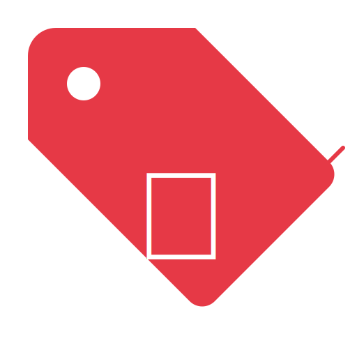

<p align="center">
  
</p>

<h1 align="center">Bekam - بكام</h1>

<p align="center">
  <strong>Community-powered grocery price comparison for Egypt</strong>
</p>

<p align="center">
  
  
  
  
  
</p>

---

## What is Bekam?

Bekam (بكام - "How much?") lets Egyptian shoppers compare grocery prices across stores in their area. Users submit prices they find, vote on accuracy, and help each other find the cheapest deals.

Think of it as Waze, but for grocery prices.

## Features

- **Search & compare** grocery prices across stores in your governorate
- **Voice search** - tap the mic and speak a product name in Arabic or English
- **Voice price submission** - say the product, store, and price naturally
- **Barcode scanning** - scan a product to find or submit its price
- **Price alerts** - get notified when a product drops below your target
- **Community voting** - upvote or downvote prices to keep them accurate
- **Shopping baskets** - add products to a basket, find the cheapest store for all of them
- **Price trends** - track inflation and price changes over time
- **Weekly challenges** - community competitions with leaderboards
- **Trust system** - earn reputation from Newcomer to Champion

## Platform

- **Bilingual** - Arabic (Egyptian dialect) and English with full RTL support
- **6 color themes** - Red, Blue, Green, Purple, Orange, Teal
- **PWA** - installable on mobile, works offline
- **Push notifications** - alerts delivered even when the app is closed

## Setup

```bash
npm install
cp .env.example .env   # fill in the values below
npm run dev            # http://localhost:5173
```

### Environment Variables

| Variable | Required | Description |
|----------|----------|-------------|
| `VITE_SUPABASE_URL` | Yes | Supabase project URL |
| `VITE_SUPABASE_ANON_KEY` | Yes | Supabase public API key |
| `VITE_API_URL` | Yes | Backend API URL (default: `http://localhost:3001/api`) |
| `VITE_SENTRY_DSN` | No | Sentry DSN for error monitoring |

### Scripts

```bash
npm run dev       # Dev server
npm run build     # Production build --> dist/
npm run test      # Run tests
npm run lint      # Lint code
```

## Tech Stack

React 18 &bull; TypeScript &bull; Vite &bull; TailwindCSS &bull; React Router 6 &bull; Supabase (Auth + Storage) &bull; Axios &bull; i18next &bull; Recharts &bull; Lucide Icons &bull; QuaggaJS &bull; Vitest &bull; Sentry

---

<p align="center">
  Built with &#10084; in Egypt
</p>
